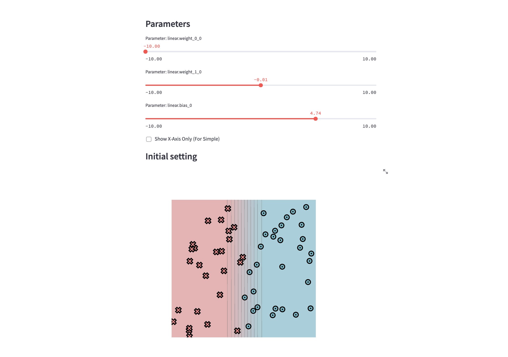

# minitorch
The full minitorch student suite. 

To access the autograder: 

* Module 0: https://classroom.github.com/a/qDYKZff9
* Module 1: https://classroom.github.com/a/6TiImUiy
* Module 2: https://classroom.github.com/a/0ZHJeTA0
* Module 3: https://classroom.github.com/a/U5CMJec1
* Module 4: https://classroom.github.com/a/04QA6HZK
* Quizzes: https://classroom.github.com/a/bGcGc12k

# Task 0.5: Visualization

# Task 1.5: Training (Logs)
## Simple
Epoch: 0/2000, loss: 0, correct: 0
Epoch: 10/2000, loss: 35.53369643088445, correct: 20
Epoch: 20/2000, loss: 35.18998301454325, correct: 22
Epoch: 30/2000, loss: 34.87485190155096, correct: 23
Epoch: 40/2000, loss: 34.57704846564536, correct: 24
Epoch: 50/2000, loss: 34.28748220037741, correct: 26
Epoch: 60/2000, loss: 33.99821670928111, correct: 29
Epoch: 70/2000, loss: 33.70196130161151, correct: 33
Epoch: 80/2000, loss: 33.391708590938634, correct: 35
Epoch: 90/2000, loss: 33.06044866869192, correct: 39
Epoch: 100/2000, loss: 32.70093471589983, correct: 41
Epoch: 110/2000, loss: 32.30549057684784, correct: 41
Epoch: 120/2000, loss: 31.865863017764134, correct: 41
Epoch: 130/2000, loss: 31.373134786132063, correct: 46
Epoch: 140/2000, loss: 30.81773117171552, correct: 47
Epoch: 150/2000, loss: 30.189573363659783, correct: 48
Epoch: 160/2000, loss: 29.478454943891663, correct: 49
Epoch: 170/2000, loss: 28.693417855927034, correct: 49
Epoch: 180/2000, loss: 27.818526366319656, correct: 48
Epoch: 190/2000, loss: 26.848694536921023, correct: 49
Epoch: 200/2000, loss: 25.78686882135106, correct: 49
Epoch: 210/2000, loss: 24.637907476999455, correct: 49
Epoch: 220/2000, loss: 23.412161482796996, correct: 49
Epoch: 230/2000, loss: 22.13116310671557, correct: 49
Epoch: 240/2000, loss: 20.821817699918643, correct: 49
Epoch: 250/2000, loss: 19.50938352246284, correct: 49
Epoch: 260/2000, loss: 18.224589841115726, correct: 49
Epoch: 270/2000, loss: 16.993389799429977, correct: 49
Epoch: 280/2000, loss: 15.8318758800094, correct: 49
Epoch: 290/2000, loss: 14.758242420214355, correct: 49
Epoch: 300/2000, loss: 13.769673516415027, correct: 49
Epoch: 310/2000, loss: 12.86134454934456, correct: 49
Epoch: 320/2000, loss: 12.024976101349688, correct: 49
Epoch: 330/2000, loss: 11.25643337266041, correct: 49
Epoch: 340/2000, loss: 10.550774806823302, correct: 49
Epoch: 350/2000, loss: 9.902804124252963, correct: 49
Epoch: 360/2000, loss: 9.308875222546865, correct: 49
Epoch: 370/2000, loss: 8.76434618712636, correct: 49
Epoch: 380/2000, loss: 8.262769696828087, correct: 49
Epoch: 390/2000, loss: 7.800556459388695, correct: 49
Epoch: 400/2000, loss: 7.373405374772791, correct: 49
Epoch: 410/2000, loss: 6.978913875767379, correct: 50
Epoch: 420/2000, loss: 6.613749983858477, correct: 50
Epoch: 430/2000, loss: 6.274952681620571, correct: 50
Epoch: 440/2000, loss: 5.960990620382908, correct: 50
Epoch: 450/2000, loss: 5.669317426303357, correct: 50
Epoch: 460/2000, loss: 5.399590152088909, correct: 50
Epoch: 470/2000, loss: 5.148200739244363, correct: 50
Epoch: 480/2000, loss: 4.913743073330305, correct: 50
Epoch: 490/2000, loss: 4.694971760343442, correct: 50
Epoch: 500/2000, loss: 4.490586597197868, correct: 50
Epoch: 510/2000, loss: 4.2994566812992865, correct: 50
Epoch: 520/2000, loss: 4.120466794556497, correct: 50
Epoch: 530/2000, loss: 3.9526928408911273, correct: 50
Epoch: 540/2000, loss: 3.795291878336481, correct: 50
Epoch: 550/2000, loss: 3.6475800307699258, correct: 50
Epoch: 560/2000, loss: 3.508734806845431, correct: 50
Epoch: 570/2000, loss: 3.3780959800640717, correct: 50
Epoch: 580/2000, loss: 3.255210360183505, correct: 50
Epoch: 590/2000, loss: 3.1399301626631044, correct: 50
Epoch: 600/2000, loss: 3.031048949955749, correct: 50
Epoch: 610/2000, loss: 2.928123057873724, correct: 50
Epoch: 620/2000, loss: 2.8309684257357066, correct: 50
Epoch: 630/2000, loss: 2.739354134347838, correct: 50
Epoch: 640/2000, loss: 2.6525500051130275, correct: 50
Epoch: 650/2000, loss: 2.570211851995993, correct: 50
Epoch: 660/2000, loss: 2.492067016664561, correct: 50
Epoch: 670/2000, loss: 2.4178134010891403, correct: 50
Epoch: 680/2000, loss: 2.3471844090027547, correct: 50
Epoch: 690/2000, loss: 2.279945399718939, correct: 50
Epoch: 700/2000, loss: 2.2158799744555386, correct: 50
Epoch: 710/2000, loss: 2.1547883831449233, correct: 50
Epoch: 720/2000, loss: 2.096537934917357, correct: 50
Epoch: 730/2000, loss: 2.0410774171615387, correct: 50
Epoch: 740/2000, loss: 1.9880471810477565, correct: 50
Epoch: 750/2000, loss: 1.937303556687152, correct: 50
Epoch: 760/2000, loss: 1.8887324085119845, correct: 50
Epoch: 770/2000, loss: 1.842199243478967, correct: 50
Epoch: 780/2000, loss: 1.7975831035265892, correct: 50
Epoch: 790/2000, loss: 1.7547734339277994, correct: 50
Epoch: 800/2000, loss: 1.71373805614635, correct: 50
Epoch: 810/2000, loss: 1.6744049521654558, correct: 50
Epoch: 820/2000, loss: 1.636591949858321, correct: 50
Epoch: 830/2000, loss: 1.6002180315142958, correct: 50
Epoch: 840/2000, loss: 1.5652081023308666, correct: 50
Epoch: 850/2000, loss: 1.531491991598606, correct: 50
Epoch: 860/2000, loss: 1.4990040617878941, correct: 50
Epoch: 870/2000, loss: 1.4676828555389398, correct: 50
Epoch: 880/2000, loss: 1.4374707752394216, correct: 50
Epoch: 890/2000, loss: 1.4083137916606303, correct: 50
Epoch: 900/2000, loss: 1.3801611785587726, correct: 50
Epoch: 910/2000, loss: 1.3529652705287405, correct: 50
Epoch: 920/2000, loss: 1.3266812417262104, correct: 50
Epoch: 930/2000, loss: 1.30126763344328, correct: 50
Epoch: 940/2000, loss: 1.276703855806692, correct: 50
Epoch: 950/2000, loss: 1.2529299058430607, correct: 50
Epoch: 960/2000, loss: 1.229910738676601, correct: 50
Epoch: 970/2000, loss: 1.2076132717531713, correct: 50
Epoch: 980/2000, loss: 1.186006239517229, correct: 50
Epoch: 990/2000, loss: 1.1650600748994067, correct: 50
Epoch: 1000/2000, loss: 1.144746799765933, correct: 50
Epoch: 1010/2000, loss: 1.1250399234860844, correct: 50
Epoch: 1020/2000, loss: 1.1059143489389518, correct: 50
Epoch: 1030/2000, loss: 1.087346285345147, correct: 50
Epoch: 1040/2000, loss: 1.0693131673654785, correct: 50
Epoch: 1050/2000, loss: 1.0517935799595675, correct: 50
Epoch: 1060/2000, loss: 1.0347671885428171, correct: 50
Epoch: 1070/2000, loss: 1.0182146740214046, correct: 50
Epoch: 1080/2000, loss: 1.002117672321928, correct: 50
Epoch: 1090/2000, loss: 0.9864587180658081, correct: 50
Epoch: 1100/2000, loss: 0.9712211920688386, correct: 50
Epoch: 1110/2000, loss: 0.9563892723735326, correct: 50
Epoch: 1120/2000, loss: 0.9419478885467937, correct: 50
Epoch: 1130/2000, loss: 0.9278826789978069, correct: 50
Epoch: 1140/2000, loss: 0.914179951091514, correct: 50
Epoch: 1150/2000, loss: 0.9008324336977688, correct: 50
Epoch: 1160/2000, loss: 0.8878216515235057, correct: 50
Epoch: 1170/2000, loss: 0.875135367446016, correct: 50
Epoch: 1180/2000, loss: 0.8627627034061168, correct: 50
Epoch: 1190/2000, loss: 0.850692405152946, correct: 50
Epoch: 1200/2000, loss: 0.8389140816689696, correct: 50
Epoch: 1210/2000, loss: 0.8274178407004306, correct: 50
Epoch: 1220/2000, loss: 0.8161942157677394, correct: 50
Epoch: 1230/2000, loss: 0.8052341441646159, correct: 50
Epoch: 1240/2000, loss: 0.7945289462738715, correct: 50
Epoch: 1250/2000, loss: 0.7840703061101824, correct: 50
Epoch: 1260/2000, loss: 0.7738502530076538, correct: 50
Epoch: 1270/2000, loss: 0.7638611443760625, correct: 50
Epoch: 1280/2000, loss: 0.7540956494552336, correct: 50
Epoch: 1290/2000, loss: 0.7445467340022629, correct: 50
Epoch: 1300/2000, loss: 0.7352076458509976, correct: 50
Epoch: 1310/2000, loss: 0.7260719012875735, correct: 50
Epoch: 1320/2000, loss: 0.7171332721898387, correct: 50
Epoch: 1330/2000, loss: 0.7083857738822043, correct: 50
Epoch: 1340/2000, loss: 0.6998236536608559, correct: 50
Epoch: 1350/2000, loss: 0.6914413799474582, correct: 50
Epoch: 1360/2000, loss: 0.6832336320323418, correct: 50
Epoch: 1370/2000, loss: 0.6751952903709191, correct: 50
Epoch: 1380/2000, loss: 0.6673214273994685, correct: 50
Epoch: 1390/2000, loss: 0.659607298838822, correct: 50
Epoch: 1400/2000, loss: 0.6520483354565569, correct: 50
Epoch: 1410/2000, loss: 0.6446401352602568, correct: 50
Epoch: 1420/2000, loss: 0.6373784560962958, correct: 50
Epoch: 1430/2000, loss: 0.6302592086302006, correct: 50
Epoch: 1440/2000, loss: 0.6232784496862872, correct: 50
Epoch: 1450/2000, loss: 0.6164323759256956, correct: 50
Epoch: 1460/2000, loss: 0.6097173178432805, correct: 50
Epoch: 1470/2000, loss: 0.6031311082514205, correct: 50
Epoch: 1480/2000, loss: 0.5966707496094273, correct: 50
Epoch: 1490/2000, loss: 0.5903330552914097, correct: 50
Epoch: 1500/2000, loss: 0.584113271986887, correct: 50
Epoch: 1510/2000, loss: 0.5780075836367302, correct: 50
Epoch: 1520/2000, loss: 0.5720130371111279, correct: 50
Epoch: 1530/2000, loss: 0.5661267773567554, correct: 50
Epoch: 1540/2000, loss: 0.5603460432540429, correct: 50
Epoch: 1550/2000, loss: 0.5546681638733367, correct: 50
Epoch: 1560/2000, loss: 0.5490905549083755, correct: 50
Epoch: 1570/2000, loss: 0.5436107152741477, correct: 50
Epoch: 1580/2000, loss: 0.5382262238606216, correct: 50
Epoch: 1590/2000, loss: 0.53293488829774, correct: 50
Epoch: 1600/2000, loss: 0.527734291280213, correct: 50
Epoch: 1610/2000, loss: 0.5226222189838354, correct: 50
Epoch: 1620/2000, loss: 0.5175965411071068, correct: 50
Epoch: 1630/2000, loss: 0.5126551931333326, correct: 50
Epoch: 1640/2000, loss: 0.5077961738666062, correct: 50
Epoch: 1650/2000, loss: 0.5030175430757432, correct: 50
Epoch: 1660/2000, loss: 0.4983174192406178, correct: 50
Epoch: 1670/2000, loss: 0.4936939773959084, correct: 50
Epoch: 1680/2000, loss: 0.48914544706746405, correct: 50
Epoch: 1690/2000, loss: 0.48467011029678025, correct: 50
Epoch: 1700/2000, loss: 0.4802662997492681, correct: 50
Epoch: 1710/2000, loss: 0.47593239690228606, correct: 50
Epoch: 1720/2000, loss: 0.47166683030908724, correct: 50
Epoch: 1730/2000, loss: 0.46746807393507167, correct: 50
Epoch: 1740/2000, loss: 0.4633346455628911, correct: 50
Epoch: 1750/2000, loss: 0.4592651052631563, correct: 50
Epoch: 1760/2000, loss: 0.45525805392768465, correct: 50
Epoch: 1770/2000, loss: 0.451312131862354, correct: 50
Epoch: 1780/2000, loss: 0.4474260174367919, correct: 50
Epoch: 1790/2000, loss: 0.4435984257883073, correct: 50
Epoch: 1800/2000, loss: 0.4398281075775406, correct: 50
Epoch: 1810/2000, loss: 0.43611384779350043, correct: 50
Epoch: 1820/2000, loss: 0.4324544646057392, correct: 50
Epoch: 1830/2000, loss: 0.4288488082615461, correct: 50
Epoch: 1840/2000, loss: 0.42529576002612507, correct: 50
Epoch: 1850/2000, loss: 0.42179423116387976, correct: 50
Epoch: 1860/2000, loss: 0.4183431619589304, correct: 50
Epoch: 1870/2000, loss: 0.4149415207731826, correct: 50
Epoch: 1880/2000, loss: 0.41158830314027467, correct: 50
Epoch: 1890/2000, loss: 0.40828253089385014, correct: 50
Epoch: 1900/2000, loss: 0.4050232513286688, correct: 50
Epoch: 1910/2000, loss: 0.4018095363931332, correct: 50
Epoch: 1920/2000, loss: 0.398640481911898, correct: 50
Epoch: 1930/2000, loss: 0.39551520683726454, correct: 50
Epoch: 1940/2000, loss: 0.3924328525281513, correct: 50
Epoch: 1950/2000, loss: 0.3893925820554775, correct: 50
Epoch: 1960/2000, loss: 0.38639357953284464, correct: 50
Epoch: 1970/2000, loss: 0.38343504947146606, correct: 50
Epoch: 1980/2000, loss: 0.3805162161583414, correct: 50
Epoch: 1990/2000, loss: 0.377636323056713, correct: 50
Epoch: 2000/2000, loss: 0.37479463222788784, correct: 50

# Diag
Epoch: 0/2000, loss: 0, correct: 0
Epoch: 10/2000, loss: 17.67737271326616, correct: 48
Epoch: 20/2000, loss: 10.548466651265043, correct: 48
Epoch: 30/2000, loss: 8.3690544062208, correct: 48
Epoch: 40/2000, loss: 7.530803445590353, correct: 48
Epoch: 50/2000, loss: 7.1464897112970664, correct: 48
Epoch: 60/2000, loss: 6.941118383179938, correct: 48
Epoch: 70/2000, loss: 6.815158749621924, correct: 48
Epoch: 80/2000, loss: 6.728980959778717, correct: 48
Epoch: 90/2000, loss: 6.664374231937555, correct: 48
Epoch: 100/2000, loss: 6.610958904803679, correct: 48
Epoch: 110/2000, loss: 6.564228565432124, correct: 48
Epoch: 120/2000, loss: 6.520811717171316, correct: 48
Epoch: 130/2000, loss: 6.47931082962974, correct: 48
Epoch: 140/2000, loss: 6.438740095046643, correct: 48
Epoch: 150/2000, loss: 6.398966935410341, correct: 48
Epoch: 160/2000, loss: 6.359373518851777, correct: 48
Epoch: 170/2000, loss: 6.319983966201637, correct: 48
Epoch: 180/2000, loss: 6.280558779737851, correct: 48
Epoch: 190/2000, loss: 6.240998907987896, correct: 48
Epoch: 200/2000, loss: 6.2012737695598235, correct: 48
Epoch: 210/2000, loss: 6.161297199367438, correct: 48
Epoch: 220/2000, loss: 6.121046301500364, correct: 48
Epoch: 230/2000, loss: 6.08059272386142, correct: 48
Epoch: 240/2000, loss: 6.039863613608011, correct: 48
Epoch: 250/2000, loss: 5.998798928569699, correct: 48
Epoch: 260/2000, loss: 5.957385118184017, correct: 48
Epoch: 270/2000, loss: 5.915644224989903, correct: 48
Epoch: 280/2000, loss: 5.873538653942016, correct: 48
Epoch: 290/2000, loss: 5.831043521993287, correct: 48
Epoch: 300/2000, loss: 5.788147462373666, correct: 48
Epoch: 310/2000, loss: 5.7449166943320495, correct: 48
Epoch: 320/2000, loss: 5.7013764414815835, correct: 48
Epoch: 330/2000, loss: 5.657407839777437, correct: 48
Epoch: 340/2000, loss: 5.612991901528619, correct: 48
Epoch: 350/2000, loss: 5.568134403617676, correct: 48
Epoch: 360/2000, loss: 5.522803832429066, correct: 48
Epoch: 370/2000, loss: 5.476993427731476, correct: 48
Epoch: 380/2000, loss: 5.4306972823408195, correct: 48
Epoch: 390/2000, loss: 5.3839104208533515, correct: 48
Epoch: 400/2000, loss: 5.336628883261565, correct: 48
Epoch: 410/2000, loss: 5.288849812951345, correct: 48
Epoch: 420/2000, loss: 5.240571548566042, correct: 48
Epoch: 430/2000, loss: 5.191793719154948, correct: 48
Epoch: 440/2000, loss: 5.142517341919138, correct: 48
Epoch: 450/2000, loss: 5.092744921737572, correct: 48
Epoch: 460/2000, loss: 5.0424806459260445, correct: 48
Epoch: 470/2000, loss: 4.991739705600768, correct: 48
Epoch: 480/2000, loss: 4.940518994008419, correct: 48
Epoch: 490/2000, loss: 4.888832627304481, correct: 48
Epoch: 500/2000, loss: 4.836690875320393, correct: 48
Epoch: 510/2000, loss: 4.784115810873362, correct: 48
Epoch: 520/2000, loss: 4.731110561344371, correct: 48
Epoch: 530/2000, loss: 4.677690779141876, correct: 48
Epoch: 540/2000, loss: 4.62387674990985, correct: 48
Epoch: 550/2000, loss: 4.569691041829714, correct: 48
Epoch: 560/2000, loss: 4.515158527927198, correct: 48
Epoch: 570/2000, loss: 4.46030638909924, correct: 48
Epoch: 580/2000, loss: 4.4051640958888, correct: 48
Epoch: 590/2000, loss: 4.349763367272773, correct: 48
Epoch: 600/2000, loss: 4.296177161676558, correct: 48
Epoch: 610/2000, loss: 4.251228200339647, correct: 48
Epoch: 620/2000, loss: 4.208816178294222, correct: 48
Epoch: 630/2000, loss: 4.1682394572481165, correct: 48
Epoch: 640/2000, loss: 4.127651554068939, correct: 48
Epoch: 650/2000, loss: 4.08811878729848, correct: 48
Epoch: 660/2000, loss: 4.049004139916762, correct: 48
Epoch: 670/2000, loss: 4.010151956706741, correct: 48
Epoch: 680/2000, loss: 3.9714845748524477, correct: 48
Epoch: 690/2000, loss: 3.9332067676914724, correct: 48
Epoch: 700/2000, loss: 3.895259821186002, correct: 48
Epoch: 710/2000, loss: 3.8568816738154723, correct: 48
Epoch: 720/2000, loss: 3.819390375035643, correct: 48
Epoch: 730/2000, loss: 3.7815184894177336, correct: 48
Epoch: 740/2000, loss: 3.744197141437697, correct: 48
Epoch: 750/2000, loss: 3.7068839785734653, correct: 48
Epoch: 760/2000, loss: 3.6695849859813903, correct: 48
Epoch: 770/2000, loss: 3.632464096580374, correct: 48
Epoch: 780/2000, loss: 3.5955156289289465, correct: 48
Epoch: 790/2000, loss: 3.558414702841578, correct: 48
Epoch: 800/2000, loss: 3.521831326758413, correct: 48
Epoch: 810/2000, loss: 3.4854220121655035, correct: 48
Epoch: 820/2000, loss: 3.4489644774832686, correct: 48
Epoch: 830/2000, loss: 3.4129062423450276, correct: 48
Epoch: 840/2000, loss: 3.3769311834105, correct: 48
Epoch: 850/2000, loss: 3.341174774882613, correct: 48
Epoch: 860/2000, loss: 3.3055500935822275, correct: 48
Epoch: 870/2000, loss: 3.2702551641892033, correct: 49
Epoch: 880/2000, loss: 3.2350440911243643, correct: 49
Epoch: 890/2000, loss: 3.2000790866910718, correct: 49
Epoch: 900/2000, loss: 3.1653578665032085, correct: 49
Epoch: 910/2000, loss: 3.1308799705126953, correct: 49
Epoch: 920/2000, loss: 3.0966485285022096, correct: 49
Epoch: 930/2000, loss: 3.062668087543791, correct: 49
Epoch: 940/2000, loss: 3.0289438899151535, correct: 49
Epoch: 950/2000, loss: 2.9954815165762785, correct: 49
Epoch: 960/2000, loss: 2.9622866800271774, correct: 49
Epoch: 970/2000, loss: 2.929365101845389, correct: 49
Epoch: 980/2000, loss: 2.8967224380796988, correct: 49
Epoch: 990/2000, loss: 2.8643642316161113, correct: 49
Epoch: 1000/2000, loss: 2.8322958797398563, correct: 49
Epoch: 1010/2000, loss: 2.800522610310006, correct: 49
Epoch: 1020/2000, loss: 2.769049462912656, correct: 49
Epoch: 1030/2000, loss: 2.737881293268957, correct: 49
Epoch: 1040/2000, loss: 2.7070238242342817, correct: 49
Epoch: 1050/2000, loss: 2.676480216571344, correct: 49
Epoch: 1060/2000, loss: 2.646254618988335, correct: 49
Epoch: 1070/2000, loss: 2.619601520575894, correct: 49
Epoch: 1080/2000, loss: 2.599861448617442, correct: 49
Epoch: 1090/2000, loss: 2.5807828995065094, correct: 49
Epoch: 1100/2000, loss: 2.5621029424653194, correct: 49
Epoch: 1110/2000, loss: 2.5436860428016246, correct: 49
Epoch: 1120/2000, loss: 2.525462531186284, correct: 49
Epoch: 1130/2000, loss: 2.5073971009318132, correct: 49
Epoch: 1140/2000, loss: 2.489472432890151, correct: 49
Epoch: 1150/2000, loss: 2.4716806027078717, correct: 49
Epoch: 1160/2000, loss: 2.4540185497877025, correct: 49
Epoch: 1170/2000, loss: 2.436485685711411, correct: 49
Epoch: 1180/2000, loss: 2.4190826352421904, correct: 49
Epoch: 1190/2000, loss: 2.401810577759453, correct: 49
Epoch: 1200/2000, loss: 2.384670906470377, correct: 49
Epoch: 1210/2000, loss: 2.3676650550070755, correct: 49
Epoch: 1220/2000, loss: 2.350794411488716, correct: 49
Epoch: 1230/2000, loss: 2.334060277747081, correct: 49
Epoch: 1240/2000, loss: 2.3174638514811785, correct: 49
Epoch: 1250/2000, loss: 2.3010062197761765, correct: 49
Epoch: 1260/2000, loss: 2.284688358061959, correct: 49
Epoch: 1270/2000, loss: 2.268511131541796, correct: 49
Epoch: 1280/2000, loss: 2.252475297650379, correct: 49
Epoch: 1290/2000, loss: 2.236581508877075, correct: 49
Epoch: 1300/2000, loss: 2.2208303156741427, correct: 49
Epoch: 1310/2000, loss: 2.2052221693515737, correct: 49
Epoch: 1320/2000, loss: 2.189757424940393, correct: 49
Epoch: 1330/2000, loss: 2.1744363440368737, correct: 49
Epoch: 1340/2000, loss: 2.1592590976475106, correct: 49
Epoch: 1350/2000, loss: 2.144225769052543, correct: 49
Epoch: 1360/2000, loss: 2.1293363567001986, correct: 49
Epoch: 1370/2000, loss: 2.114590777137962, correct: 49
Epoch: 1380/2000, loss: 2.0999888679819954, correct: 49
Epoch: 1390/2000, loss: 2.085530390921745, correct: 49
Epoch: 1400/2000, loss: 2.071215034753893, correct: 49
Epoch: 1410/2000, loss: 2.0570424184377485, correct: 49
Epoch: 1420/2000, loss: 2.043012094162983, correct: 49
Epoch: 1430/2000, loss: 2.029123550419967, correct: 49
Epoch: 1440/2000, loss: 2.015376215062827, correct: 49
Epoch: 1450/2000, loss: 2.0017694583553864, correct: 49
Epoch: 1460/2000, loss: 1.9883025959906744, correct: 49
Epoch: 1470/2000, loss: 1.974974892075087, correct: 49
Epoch: 1480/2000, loss: 1.9617855620690219, correct: 49
Epoch: 1490/2000, loss: 1.948733775676517, correct: 49
Epoch: 1500/2000, loss: 1.9358186596771048, correct: 49
Epoch: 1510/2000, loss: 1.923039300693944, correct: 49
Epoch: 1520/2000, loss: 1.9103947478929715, correct: 49
Epoch: 1530/2000, loss: 1.8978840156086285, correct: 49
Epoch: 1540/2000, loss: 1.8855060858923527, correct: 49
Epoch: 1550/2000, loss: 1.8732599109807528, correct: 49
Epoch: 1560/2000, loss: 1.8611444156810375, correct: 49
Epoch: 1570/2000, loss: 1.8491584996718176, correct: 49
Epoch: 1580/2000, loss: 1.8373010397179954, correct: 49
Epoch: 1590/2000, loss: 1.8255708917989801, correct: 49
Epoch: 1600/2000, loss: 1.8139668931498958, correct: 49
Epoch: 1610/2000, loss: 1.8024878642159199, correct: 49
Epoch: 1620/2000, loss: 1.791132610520235, correct: 49
Epoch: 1630/2000, loss: 1.7798999244464766, correct: 49
Epoch: 1640/2000, loss: 1.768788586936781, correct: 49
Epoch: 1650/2000, loss: 1.7577973691069149, correct: 49
Epoch: 1660/2000, loss: 1.7469250337800801, correct: 49
Epoch: 1670/2000, loss: 1.7361703369412964, correct: 49
Epoch: 1680/2000, loss: 1.7255320291143519, correct: 49
Epoch: 1690/2000, loss: 1.7150088566635078, correct: 49
Epoch: 1700/2000, loss: 1.7045995630222073, correct: 49
Epoch: 1710/2000, loss: 1.6943028898511796, correct: 49
Epoch: 1720/2000, loss: 1.6841175781283477, correct: 49
Epoch: 1730/2000, loss: 1.6740423691730257, correct: 49
Epoch: 1740/2000, loss: 1.6640760056069213, correct: 49
Epoch: 1750/2000, loss: 1.6542172322544235, correct: 49
Epoch: 1760/2000, loss: 1.6444647969847486, correct: 49
Epoch: 1770/2000, loss: 1.6348174514983729, correct: 49
Epoch: 1780/2000, loss: 1.625273952060288, correct: 49
Epoch: 1790/2000, loss: 1.6158330601824542, correct: 49
Epoch: 1800/2000, loss: 1.6064935432578997, correct: 49
Epoch: 1810/2000, loss: 1.597254175148742, correct: 49
Epoch: 1820/2000, loss: 1.5881137367304667, correct: 49
Epoch: 1830/2000, loss: 1.5790710163946249, correct: 49
Epoch: 1840/2000, loss: 1.5701248105121537, correct: 49
Epoch: 1850/2000, loss: 1.5612739238593472, correct: 49
Epoch: 1860/2000, loss: 1.5525171700085154, correct: 49
Epoch: 1870/2000, loss: 1.5438533716852507, correct: 49
Epoch: 1880/2000, loss: 1.53528136109417, correct: 49
Epoch: 1890/2000, loss: 1.5267999802148915, correct: 50
Epoch: 1900/2000, loss: 1.5184080810699832, correct: 50
Epoch: 1910/2000, loss: 1.5101045259664978, correct: 50
Epoch: 1920/2000, loss: 1.501888187712649, correct: 50
Epoch: 1930/2000, loss: 1.493757949811143, correct: 50
Epoch: 1940/2000, loss: 1.4857127066305316, correct: 50
Epoch: 1950/2000, loss: 1.4777513635559951, correct: 50
Epoch: 1960/2000, loss: 1.4698728371207812, correct: 50
Epoch: 1970/2000, loss: 1.4620760551195517, correct: 50
Epoch: 1980/2000, loss: 1.4543599567047603, correct: 50
Epoch: 1990/2000, loss: 1.446723492467171, correct: 50
Epoch: 2000/2000, loss: 1.4391656245015394, correct: 50

# Split
Epoch: 0/2000, loss: 0, correct: 0
Epoch: 10/2000, loss: 33.07060804693042, correct: 35
Epoch: 20/2000, loss: 32.888896757893534, correct: 34
Epoch: 30/2000, loss: 32.72988968073884, correct: 33
Epoch: 40/2000, loss: 32.56788204548866, correct: 33
Epoch: 50/2000, loss: 32.414587279901276, correct: 33
Epoch: 60/2000, loss: 32.257646529561924, correct: 33
Epoch: 70/2000, loss: 32.10337578165025, correct: 33
Epoch: 80/2000, loss: 31.950995538548852, correct: 34
Epoch: 90/2000, loss: 31.795697723802398, correct: 35
Epoch: 100/2000, loss: 31.635615493099685, correct: 35
Epoch: 110/2000, loss: 31.473088722227967, correct: 35
Epoch: 120/2000, loss: 31.309031466359393, correct: 36
Epoch: 130/2000, loss: 31.13833466574781, correct: 37
Epoch: 140/2000, loss: 30.972249584278675, correct: 37
Epoch: 150/2000, loss: 30.81062359953262, correct: 37
Epoch: 160/2000, loss: 30.643245380895625, correct: 37
Epoch: 170/2000, loss: 30.472243860342793, correct: 37
Epoch: 180/2000, loss: 30.311388325270173, correct: 37
Epoch: 190/2000, loss: 30.14753539648303, correct: 37
Epoch: 200/2000, loss: 29.98094034537695, correct: 37
Epoch: 210/2000, loss: 29.810372680018023, correct: 37
Epoch: 220/2000, loss: 29.644015363969704, correct: 37
Epoch: 230/2000, loss: 29.47994110069599, correct: 37
Epoch: 240/2000, loss: 29.313914231917774, correct: 37
Epoch: 250/2000, loss: 29.14464929877489, correct: 37
Epoch: 260/2000, loss: 28.97865094614047, correct: 38
Epoch: 270/2000, loss: 28.815280015042926, correct: 38
Epoch: 280/2000, loss: 28.652283302682367, correct: 38
Epoch: 290/2000, loss: 28.48738531750596, correct: 38
Epoch: 300/2000, loss: 28.31953825976918, correct: 38
Epoch: 310/2000, loss: 28.148205591438654, correct: 38
Epoch: 320/2000, loss: 27.974024796734852, correct: 38
Epoch: 330/2000, loss: 27.80366222423522, correct: 38
Epoch: 340/2000, loss: 27.640537182521424, correct: 38
Epoch: 350/2000, loss: 27.47841345016084, correct: 38
Epoch: 360/2000, loss: 27.314615444182863, correct: 38
Epoch: 370/2000, loss: 27.14830323045282, correct: 38
Epoch: 380/2000, loss: 26.97925414131337, correct: 38
Epoch: 390/2000, loss: 26.806602612496548, correct: 38
Epoch: 400/2000, loss: 26.630086332116726, correct: 38
Epoch: 410/2000, loss: 26.449399966543645, correct: 38
Epoch: 420/2000, loss: 26.264256484101736, correct: 38
Epoch: 430/2000, loss: 26.07433832513231, correct: 38
Epoch: 440/2000, loss: 25.879633489013237, correct: 38
Epoch: 450/2000, loss: 25.684462003519425, correct: 39
Epoch: 460/2000, loss: 25.487047811798785, correct: 39
Epoch: 470/2000, loss: 25.295376866502362, correct: 39
Epoch: 480/2000, loss: 25.106442708618033, correct: 39
Epoch: 490/2000, loss: 24.927842970814304, correct: 39
Epoch: 500/2000, loss: 24.752988826213354, correct: 39
Epoch: 510/2000, loss: 24.579944754322614, correct: 39
Epoch: 520/2000, loss: 24.409096854897427, correct: 39
Epoch: 530/2000, loss: 24.238944371718237, correct: 39
Epoch: 540/2000, loss: 24.068697576219265, correct: 39
Epoch: 550/2000, loss: 23.89814557753343, correct: 39
Epoch: 560/2000, loss: 23.72657344463693, correct: 40
Epoch: 570/2000, loss: 23.553388711679677, correct: 40
Epoch: 580/2000, loss: 23.37864285990678, correct: 40
Epoch: 590/2000, loss: 23.202461531392675, correct: 40
Epoch: 600/2000, loss: 23.024947149286156, correct: 40
Epoch: 610/2000, loss: 22.849763713094525, correct: 40
Epoch: 620/2000, loss: 22.67521585309596, correct: 40
Epoch: 630/2000, loss: 22.500643277961206, correct: 40
Epoch: 640/2000, loss: 22.32945509344621, correct: 40
Epoch: 650/2000, loss: 22.158337721908648, correct: 40
Epoch: 660/2000, loss: 21.986370467404743, correct: 41
Epoch: 670/2000, loss: 21.813569743208447, correct: 42
Epoch: 680/2000, loss: 21.63968380936248, correct: 42
Epoch: 690/2000, loss: 21.46642611830743, correct: 42
Epoch: 700/2000, loss: 21.292442682191496, correct: 42
Epoch: 710/2000, loss: 21.11765389900075, correct: 42
Epoch: 720/2000, loss: 20.94516646740363, correct: 42
Epoch: 730/2000, loss: 20.774824544060355, correct: 42
Epoch: 740/2000, loss: 20.601928548266326, correct: 42
Epoch: 750/2000, loss: 20.43043602557739, correct: 42
Epoch: 760/2000, loss: 20.257696569027623, correct: 42
Epoch: 770/2000, loss: 20.084131781952458, correct: 42
Epoch: 780/2000, loss: 19.91389731448077, correct: 42
Epoch: 790/2000, loss: 19.73770487719587, correct: 42
Epoch: 800/2000, loss: 19.56640205671477, correct: 42
Epoch: 810/2000, loss: 19.393623782200518, correct: 42
Epoch: 820/2000, loss: 19.221144805114886, correct: 42
Epoch: 830/2000, loss: 19.051185346930563, correct: 42
Epoch: 840/2000, loss: 18.878470754952673, correct: 42
Epoch: 850/2000, loss: 18.70513834810175, correct: 42
Epoch: 860/2000, loss: 18.534366390537357, correct: 42
Epoch: 870/2000, loss: 18.363524228156418, correct: 42
Epoch: 880/2000, loss: 18.190961371682913, correct: 42
Epoch: 890/2000, loss: 18.01599589608155, correct: 42
Epoch: 900/2000, loss: 17.845372357604475, correct: 42
Epoch: 910/2000, loss: 17.670978219889744, correct: 42
Epoch: 920/2000, loss: 17.495356887692385, correct: 42
Epoch: 930/2000, loss: 17.325796922647676, correct: 42
Epoch: 940/2000, loss: 17.149024358389305, correct: 42
Epoch: 950/2000, loss: 16.97323311944475, correct: 46
Epoch: 960/2000, loss: 16.798864636724424, correct: 46
Epoch: 970/2000, loss: 16.622772683383534, correct: 47
Epoch: 980/2000, loss: 16.448789084271635, correct: 47
Epoch: 990/2000, loss: 16.27770412128841, correct: 47
Epoch: 1000/2000, loss: 16.10382380555127, correct: 47
Epoch: 1010/2000, loss: 15.926605037865816, correct: 47
Epoch: 1020/2000, loss: 15.753375826217347, correct: 47
Epoch: 1030/2000, loss: 15.581776062478943, correct: 48
Epoch: 1040/2000, loss: 15.405785032362092, correct: 49
Epoch: 1050/2000, loss: 15.231953641856427, correct: 49
Epoch: 1060/2000, loss: 15.063318662839874, correct: 49
Epoch: 1070/2000, loss: 14.886548976191945, correct: 49
Epoch: 1080/2000, loss: 14.713170390617949, correct: 49
Epoch: 1090/2000, loss: 14.540404695906297, correct: 49
Epoch: 1100/2000, loss: 14.368954473977672, correct: 49
Epoch: 1110/2000, loss: 14.198204818046516, correct: 49
Epoch: 1120/2000, loss: 14.026493667438476, correct: 49
Epoch: 1130/2000, loss: 13.854205192800725, correct: 49
Epoch: 1140/2000, loss: 13.684742998365742, correct: 49
Epoch: 1150/2000, loss: 13.515249243775415, correct: 50
Epoch: 1160/2000, loss: 13.34594839902332, correct: 50
Epoch: 1170/2000, loss: 13.177935631208374, correct: 50
Epoch: 1180/2000, loss: 13.009915666312514, correct: 50
Epoch: 1190/2000, loss: 12.844489275118828, correct: 50
Epoch: 1200/2000, loss: 12.677747279077208, correct: 50
Epoch: 1210/2000, loss: 12.515795802098385, correct: 50
Epoch: 1220/2000, loss: 12.350466343421548, correct: 50
Epoch: 1230/2000, loss: 12.195041155255746, correct: 50
Epoch: 1240/2000, loss: 12.033271118315099, correct: 50
Epoch: 1250/2000, loss: 11.879040148347041, correct: 50
Epoch: 1260/2000, loss: 11.72383714051342, correct: 50
Epoch: 1270/2000, loss: 11.567262972869138, correct: 50
Epoch: 1280/2000, loss: 11.414479015081515, correct: 50
Epoch: 1290/2000, loss: 11.265219451615057, correct: 50
Epoch: 1300/2000, loss: 11.119343317203121, correct: 50
Epoch: 1310/2000, loss: 10.973685753283975, correct: 50
Epoch: 1320/2000, loss: 10.837065397533456, correct: 50
Epoch: 1330/2000, loss: 10.69387665880607, correct: 49
Epoch: 1340/2000, loss: 10.560203053485031, correct: 49
Epoch: 1350/2000, loss: 10.427494627386421, correct: 49
Epoch: 1360/2000, loss: 10.285876631147039, correct: 49
Epoch: 1370/2000, loss: 10.15875233682534, correct: 49
Epoch: 1380/2000, loss: 10.038390978089465, correct: 49
Epoch: 1390/2000, loss: 9.91693544147234, correct: 49
Epoch: 1400/2000, loss: 9.797257504733599, correct: 49
Epoch: 1410/2000, loss: 9.675061176281252, correct: 49
Epoch: 1420/2000, loss: 9.559529112561437, correct: 49
Epoch: 1430/2000, loss: 9.448816032728796, correct: 49
Epoch: 1440/2000, loss: 9.335651612555921, correct: 49
Epoch: 1450/2000, loss: 9.217002905535617, correct: 49
Epoch: 1460/2000, loss: 9.111071086767415, correct: 49
Epoch: 1470/2000, loss: 9.00019277540974, correct: 49
Epoch: 1480/2000, loss: 8.889403931162919, correct: 49
Epoch: 1490/2000, loss: 8.789675419202068, correct: 49
Epoch: 1500/2000, loss: 8.680446925037485, correct: 49
Epoch: 1510/2000, loss: 8.57790504362775, correct: 49
Epoch: 1520/2000, loss: 8.47631646001196, correct: 49
Epoch: 1530/2000, loss: 8.38388953239479, correct: 49
Epoch: 1540/2000, loss: 8.291675715088488, correct: 49
Epoch: 1550/2000, loss: 8.199006775027053, correct: 49
Epoch: 1560/2000, loss: 8.090679510164845, correct: 49
Epoch: 1570/2000, loss: 8.00355946232323, correct: 49
Epoch: 1580/2000, loss: 7.910613030934215, correct: 49
Epoch: 1590/2000, loss: 7.808650943762858, correct: 49
Epoch: 1600/2000, loss: 7.733851061909812, correct: 49
Epoch: 1610/2000, loss: 7.633400722874376, correct: 49
Epoch: 1620/2000, loss: 7.562739256372767, correct: 49
Epoch: 1630/2000, loss: 7.471830357802573, correct: 49
Epoch: 1640/2000, loss: 7.390126093324937, correct: 49
Epoch: 1650/2000, loss: 7.305150043618611, correct: 49
Epoch: 1660/2000, loss: 7.225543944202821, correct: 49
Epoch: 1670/2000, loss: 7.156300101080091, correct: 49
Epoch: 1680/2000, loss: 7.077809169595548, correct: 49
Epoch: 1690/2000, loss: 6.996701048839895, correct: 49
Epoch: 1700/2000, loss: 6.925469636744511, correct: 49
Epoch: 1710/2000, loss: 6.8495744963995255, correct: 49
Epoch: 1720/2000, loss: 6.7777654704825165, correct: 49
Epoch: 1730/2000, loss: 6.717003085860159, correct: 49
Epoch: 1740/2000, loss: 6.646272180453323, correct: 49
Epoch: 1750/2000, loss: 6.57529215262966, correct: 49
Epoch: 1760/2000, loss: 6.513578096541518, correct: 49
Epoch: 1770/2000, loss: 6.447811757129437, correct: 49
Epoch: 1780/2000, loss: 6.3755657228767575, correct: 49
Epoch: 1790/2000, loss: 6.313165406129934, correct: 49
Epoch: 1800/2000, loss: 6.252380520555565, correct: 49
Epoch: 1810/2000, loss: 6.192835019777737, correct: 49
Epoch: 1820/2000, loss: 6.132703627973663, correct: 49
Epoch: 1830/2000, loss: 6.077334382930208, correct: 49
Epoch: 1840/2000, loss: 6.0175259432719, correct: 49
Epoch: 1850/2000, loss: 5.9619254432892985, correct: 49
Epoch: 1860/2000, loss: 5.907560849717435, correct: 49
Epoch: 1870/2000, loss: 5.853657928196315, correct: 49
Epoch: 1880/2000, loss: 5.804356059541444, correct: 49
Epoch: 1890/2000, loss: 5.747428784713281, correct: 49
Epoch: 1900/2000, loss: 5.7025951423055545, correct: 49
Epoch: 1910/2000, loss: 5.645148917964978, correct: 49
Epoch: 1920/2000, loss: 5.598606222634286, correct: 49
Epoch: 1930/2000, loss: 5.5460434879896585, correct: 49
Epoch: 1940/2000, loss: 5.497463411419056, correct: 49
Epoch: 1950/2000, loss: 5.4497174310925605, correct: 49
Epoch: 1960/2000, loss: 5.402464513455848, correct: 49
Epoch: 1970/2000, loss: 5.361432212211059, correct: 49
Epoch: 1980/2000, loss: 5.309873525453402, correct: 49
Epoch: 1990/2000, loss: 5.2641605153679505, correct: 49
Epoch: 2000/2000, loss: 5.221407054888676, correct: 49

# Xor
Epoch: 0/500, loss: 0, correct: 0
Epoch: 10/500, loss: 31.21132302838463, correct: 31
Epoch: 20/500, loss: 28.509015309879228, correct: 36
Epoch: 30/500, loss: 24.973521040361085, correct: 39
Epoch: 40/500, loss: 21.069031991604735, correct: 43
Epoch: 50/500, loss: 18.346884117024963, correct: 44
Epoch: 60/500, loss: 16.015562661124523, correct: 42
Epoch: 70/500, loss: 17.45656104444155, correct: 39
Epoch: 80/500, loss: 14.042465990346582, correct: 42
Epoch: 90/500, loss: 14.684971197595628, correct: 43
Epoch: 100/500, loss: 14.375642679427116, correct: 42
Epoch: 110/500, loss: 11.77620081982064, correct: 43
Epoch: 120/500, loss: 11.431674493974922, correct: 44
Epoch: 130/500, loss: 11.24005514960841, correct: 44
Epoch: 140/500, loss: 10.683571904788268, correct: 44
Epoch: 150/500, loss: 10.382992395222448, correct: 44
Epoch: 160/500, loss: 9.700895794672157, correct: 44
Epoch: 170/500, loss: 8.735491129252393, correct: 44
Epoch: 180/500, loss: 8.366184657215726, correct: 44
Epoch: 190/500, loss: 7.996701225612679, correct: 44
Epoch: 200/500, loss: 8.313532256562995, correct: 45
Epoch: 210/500, loss: 8.017198313352935, correct: 45
Epoch: 220/500, loss: 7.655815408930814, correct: 45
Epoch: 230/500, loss: 6.647163948066685, correct: 46
Epoch: 240/500, loss: 7.327496808591596, correct: 46
Epoch: 250/500, loss: 6.62381671908934, correct: 46
Epoch: 260/500, loss: 5.61869684220851, correct: 46
Epoch: 270/500, loss: 5.35026350843804, correct: 47
Epoch: 280/500, loss: 5.010379464103438, correct: 47
Epoch: 290/500, loss: 5.923658167545932, correct: 45
Epoch: 300/500, loss: 5.236110096471443, correct: 46
Epoch: 310/500, loss: 4.543890261987314, correct: 48
Epoch: 320/500, loss: 4.092217044011201, correct: 49
Epoch: 330/500, loss: 3.8839169338742354, correct: 49
Epoch: 340/500, loss: 3.8217243188792547, correct: 49
Epoch: 350/500, loss: 3.976195091676531, correct: 48
Epoch: 360/500, loss: 4.98979032547967, correct: 46
Epoch: 370/500, loss: 3.329751861329764, correct: 49
Epoch: 380/500, loss: 4.313535043182934, correct: 47
Epoch: 390/500, loss: 3.1147286028648695, correct: 49
Epoch: 400/500, loss: 3.9855753963989926, correct: 47
Epoch: 410/500, loss: 2.8736494420869665, correct: 49
Epoch: 420/500, loss: 5.436233228362004, correct: 45
Epoch: 430/500, loss: 2.7391102232427045, correct: 49
Epoch: 440/500, loss: 4.50020876230561, correct: 46
Epoch: 450/500, loss: 2.6746167927313502, correct: 49
Epoch: 460/500, loss: 3.4296920718889723, correct: 48
Epoch: 470/500, loss: 2.483370774459653, correct: 49
Epoch: 480/500, loss: 2.5460250785459833, correct: 49
Epoch: 490/500, loss: 4.52299834729539, correct: 45
Epoch: 500/500, loss: 2.446765925837686, correct: 49